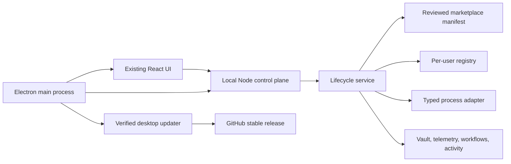
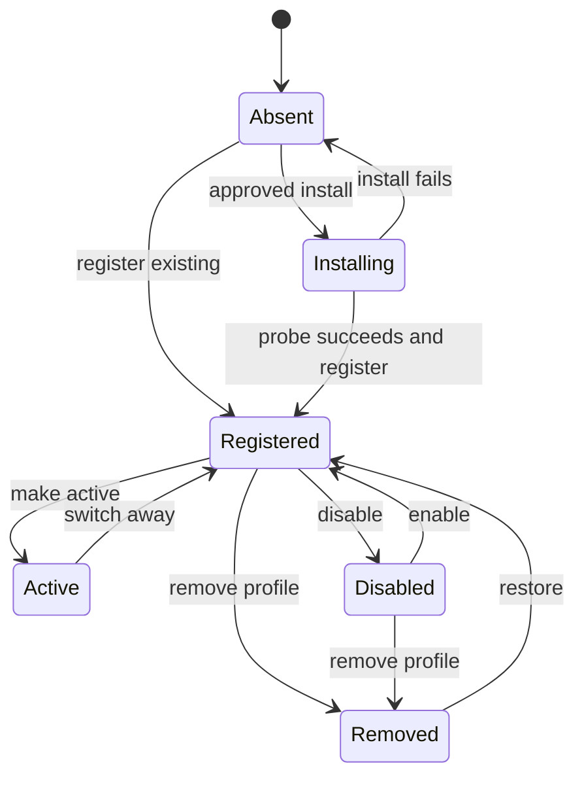

# Rempeyek Agent OS Public Agent Platform and Desktop Design

Date: 2026-07-24

Contract: `HT-20260724-RAO`

Status: approved direction, implementation not started

## Goal

Turn Rempeyek Agent OS into a public, dependable agent control plane that lets a
new user install, register, switch, disable, remove, restore, and update agents
without breaking the existing system, workflow, activity, telemetry, or vault.
Each primary agent can create purpose-built subagents from its existing profile.
The same web application becomes a Windows-first desktop application and keeps
itself current through verified releases.

This work has one absolute visual constraint: **the existing design is locked**.
Implementation may add necessary controls inside the established components,
spacing, typography, colors, theme tokens, modal language, and responsive rules.
It may not redesign the shell, navigation, cards, graph, themes, visual hierarchy,
or interaction style.

The approved technical direction is:

- a typed, manifest-driven agent/skill/plugin lifecycle;
- an Electron desktop shell that reuses the current web UI and Node server;
- profile removal that preserves all user-owned data;
- a separate Advanced uninstall action with a second explicit approval;
- stable-release auto-update that never writes into the vault.

## Non-goals and authority boundary

This design does not authorize:

- changing the existing visual design;
- publishing a release, deploying, making a repository public, rewriting Git
  history, force-pushing, deleting remote data, or buying signing certificates;
- silently installing or uninstalling software;
- accepting shell commands from a browser request or remote catalog;
- deleting an agent's vault lane, telemetry, activity, workflow definitions,
  credentials, conversation history, or user files;
- treating decorative graph relationships as operational evidence;
- implementing a hosted multi-tenant account service.

Those operations require separate authority where applicable.

## Success criteria

1. A clean public installation starts safely and exposes a curated 20-agent
   catalog, including Crimson Odyssey.
2. Hypertaks Agent is the featured plugin in Marketplace, and Marketplace can
   represent agents, plugins, and skills through one typed manifest.
3. A supported agent can be installed and registered from the existing Add Agent
   surface. Unsupported one-click installers show verified official instructions
   rather than executing a guessed command.
4. A registered agent can be enabled, disabled, made active, edited, removed from
   the registry, restored, or-when a vetted adapter exists-uninstalled.
5. Switching the active agent changes routing/default selection only. It does not
   mutate the previous agent's data or stop unrelated workflows.
6. Removing an agent profile makes it disappear from active product surfaces but
   preserves its vault, telemetry, activity, workflows, files, and a restorable
   tombstone.
7. Uninstall is a distinct Advanced action, requires approval twice, and never
   deletes user data.
8. Clicking `+` on a primary agent profile opens an existing-style form. A valid
   submission creates a parent-bound subagent and its minimal vault lane without
   inventing telemetry.
9. Settings contains lifecycle, update, startup, storage, privacy, and recovery
   controls using the existing visual system.
10. The Windows desktop package launches one local server, opens the existing UI,
    uses per-user application data, enforces single-instance behavior, and closes
    cleanly.
11. The packaged desktop app checks verified stable releases automatically,
    downloads in the background, and asks the user to restart before applying.
12. Web/source-checkout updating remains supported without conflating it with the
    packaged desktop updater.
13. All existing tests, build, public audit, four themes, responsive behavior,
    reduced motion, and accessibility contracts remain valid.

## Design decision

### Selected: manifest lifecycle plus Electron

One local manifest describes every installable entity and its capabilities.
Lifecycle logic consumes typed adapter data rather than shell strings. The
existing Node server remains the authoritative local control plane. Electron
owns only native lifecycle concerns and serves the existing React application.

This direction was selected because it:

- provides one security boundary for agents, plugins, and skills;
- preserves the existing interface and server behavior;
- supports Windows now without requiring Rust on contributor machines;
- separates registered state from installed-software state;
- gives updates, removal, restoration, and subagents explicit state transitions;
- allows new catalog entries without duplicating UI or route logic.

### Rejected: UI-only extension of the current catalog

Adding more cards and more `npm install -g ...` strings would be fast, but it
would preserve the current lifecycle gaps, conflate registration with software
installation, and fail for Winget, Python, downloadable binaries, plugins, and
skills.

### Rejected: Tauri first

Tauri can produce a smaller shell, but this repository currently depends on a
Node server and the contributor environment does not have the Rust toolchain.
It would require a Node sidecar plus Rust packaging before delivering user
value. Electron directly packages the runtime already required by the product.

### Rejected: remote executable marketplace catalog

A remotely editable catalog that can introduce install commands creates a
supply-chain execution boundary. Catalog metadata may be refreshed, but
executable adapters ship only with a reviewed, signed Rempeyek release.

## Architecture

### Ownership

- React owns presentation, forms, state refresh, approvals, and existing
  accessibility behavior.
- The Node server owns authorization, validation, registry writes, lifecycle
  transitions, process execution, audit events, and data paths.
- Pure library modules own catalog validation, state derivation, transition
  rules, install adapter resolution, subagent normalization, and update policy.
- Electron owns the desktop process, a loopback-only server, native window,
  single-instance lock, external links, startup preference, and packaged updates.
- The vault and runtime stores remain user-owned data sources. No renderer or
  marketplace entry may write them directly.

### Proposed boundaries

The implementation extends existing files surgically and introduces:

- `apps/web/lib/marketplace-manifest.mjs` - manifest schema, curated entries, and
  validation;
- `apps/web/lib/agent-lifecycle.mjs` - pure installed/registered/active state and
  allowed transitions;
- `apps/web/lib/process-adapters.mjs` - typed program/argument resolution with no
  shell;
- `apps/web/lib/subagent-record.mjs` - subagent validation and config/lane model;
- `apps/web/lib/config-store.mjs` - serialized atomic config writes, backup, and
  tombstones;
- focused server routes that delegate to those modules;
- additions to existing `AddAgentModal`, `MarketplaceView`, `AgentDetail`, and
  `SettingsView`, using existing components and tokens;
- `apps/desktop/package.json`, `main.mjs`, `preload.mjs`, and packaging config;
- tests beside the existing web tests and desktop smoke tests.

The exact file split may be reduced during planning when an existing pure module
already owns the behavior. It may not move visual ownership or duplicate state.

## Public marketplace manifest

### Entity schema

Every entry has:

- `schemaVersion`;
- immutable `id`, `kind` (`agent`, `plugin`, or `skill`), `name`, `publisher`,
  `summary`, and `sourceUrl`;
- `compatibility` with supported operating systems and host agents;
- `capabilities` used for filters and compatibility messages;
- zero or more typed `installers`;
- one or more typed `probes`;
- optional typed `uninstallers`;
- `featured`, `curatedAt`, and provenance metadata;
- optional `children` for a plugin's separately discoverable skills.

The UI never receives executable strings. Public API responses expose display
metadata, derived availability, and an opaque adapter identifier. The server
maps that identifier back to a reviewed local adapter.

### Installer types

Initial adapter types are:

- `npm-global`: package name and optional reviewed channel;
- `winget`: exact package identifier and source;
- `python-tool`: exact package name through `uv tool` or `pipx`;
- `github-release`: reviewed repository, asset pattern, checksum policy, and
  target directory;
- `external-link`: official URL and human-readable steps, never auto-executed;
- `local-profile`: registration only for an already installed or user-managed
  agent;
- `plugin-copy` and `skill-copy`: reviewed source subtree copied into a selected
  compatible host after preview.

Adapters call an executable with an argument array and `shell: false`. A route
cannot provide a program, package, URL, arguments, path, or uninstall command.
All mutation adapters require the existing approval flow and emit a redacted
audit event.

### Curated 20-agent launch catalog

“Top 20” means a maintained Rempeyek launch curation, not a numerical popularity
ranking. Entries are selected for an official source, a usable local/desktop
surface, current relevance as of 2026-07-24, and meaningful agent behavior.
Existing Rempeyek profiles are retained even when registration is local-only.

| # | Agent | Canonical source | Initial integration |
|---:|---|---|---|
| 1 | Claude Code | `github.com/anthropics/claude-code` | npm-global |
| 2 | OpenAI Codex | `github.com/openai/codex` | npm-global |
| 3 | Kilo Code | `github.com/Kilo-Org/kilocode` | npm-global |
| 4 | Cline | `github.com/cline/cline` | npm-global or official extension link |
| 5 | Pi | `github.com/badlogic/pi-mono` | npm-global |
| 6 | Antigravity | `antigravity.google` | external-link |
| 7 | Hermes | Rempeyek built-in profile | local-profile |
| 8 | OpenClaw | Rempeyek built-in profile | local-profile |
| 9 | Gemini CLI | `github.com/google-gemini/gemini-cli` | npm-global |
| 10 | GitHub Copilot CLI | `github.com/github/copilot-cli` | npm-global |
| 11 | OpenCode | `github.com/anomalyco/opencode` | npm-global or winget |
| 12 | Aider | `github.com/Aider-AI/aider` | python-tool |
| 13 | Goose | `github.com/aaif-goose/goose` | verified release or external-link |
| 14 | OpenHands | `github.com/OpenHands/OpenHands` | external-link |
| 15 | Qwen Code | `github.com/QwenLM/qwen-code` | npm-global |
| 16 | Kimi Code | `github.com/MoonshotAI/kimi-cli` | python-tool or external-link |
| 17 | Mistral Vibe | `github.com/mistralai/mistral-vibe` | python-tool or external-link |
| 18 | Cursor Agent | `cursor.com/docs/cli` | external-link |
| 19 | Crush | `github.com/charmbracelet/crush` | npm-global or winget |
| 20 | Crimson Odyssey | `github.com/Crimson-Rift-Studio/crimson-odyssey` | verified repository adapter |

Before an installer becomes executable, tests must verify its exact official
package/repository identifier and its probe on every supported operating system.
Crimson Odyssey's repository and README currently disagree on the owner in some
installation examples. Its Marketplace card is included at launch, but one-click
execution stays disabled until the canonical install target is reconciled and
locked by a test. This is an honest unavailable state, not a placeholder.

Roo Code is excluded from this current launch curation because its official
repository is archived and read-only. Crush fills that active slot.

### Featured Hypertaks plugin

`aabrur/hypertaks-agent` is the first featured Marketplace item. “Featured” uses
the existing card language and ordering; it does not introduce a new hero layout.
The entry:

- is `kind: plugin`;
- lists only host formats actually present in its public repository;
- shows its public skills as compatible child entries;
- previews target files and host location before installation;
- refuses an unknown host or a dirty overwrite collision;
- records installed version, source revision, host, target path, and file hashes;
- can remove only files whose recorded hashes still match, preserving user edits.

Other skills and plugins use the same manifest and safety behavior. Marketplace
filters by kind and compatibility inside the current view instead of creating a
new navigation system.

## Agent lifecycle

### Independent state axes

Installed software and registered profiles are independent:

- software: `unknown`, `not_installed`, `installing`, `installed`,
  `uninstalling`, `uninstall_failed`;
- profile: `absent`, `registered`, `disabled`, `active`, `removed`;
- health: `unknown`, `ready`, `degraded`, `error`.

The UI derives labels from these axes. It must not infer “installed” from a
registry row or infer “registered” from a binary probe.

### Allowed transitions

Software uninstall is deliberately outside the profile state diagram. It may
occur only from Settings > Agents > Advanced, and it changes the software axis.
It does not erase or implicitly remove the profile.

### Register

Register validates the unique slug, display name, trigger, safe paths, catalog
identity, and optional provider variables. It creates only missing lane scaffold
files and never overwrites a real brain. Custom profiles remain supported, but
cannot introduce executable installer or gateway commands.

### Switch active agent

The registry stores one optional `activeAgentId`. Making an agent active:

- requires it to be registered and enabled;
- updates the pointer atomically;
- emits an `agent.active_changed` activity record;
- leaves all running workflows and processes unchanged unless a workflow
  explicitly follows the default-routing pointer;
- falls back to no active agent if the active profile is removed.

Switching is not a process kill, uninstall, data move, or workflow reassignment.

### Disable and enable

Disable removes an agent from new default routing and blocks new manual summons
through Rempeyek. It does not stop an already running owned process. The UI
offers a separate approved Stop action where an existing gateway supports it.
Enable restores eligibility without changing active selection.

### Remove profile

The Settings action labelled **Remove agent profile**:

1. presents an impact preview listing what disappears and what is retained;
2. requires a typed agent-name confirmation through the existing modal system;
3. serializes the exact registry record into a per-user tombstone;
4. removes only the registry record and active pointer;
5. preserves vault lanes, telemetry, activity, workflows, process logs,
   credentials, installed software, and user files;
6. emits `agent.profile_removed`;
7. exposes Restore while the tombstone exists.

Tombstones contain no secret values and use the same protected per-user state
root as registry backups. Restore validates conflicts before recreating the
profile. If an ID is already occupied, restoration stops with a clear conflict;
it never merges automatically.

### Advanced uninstall

**Uninstall agent software** is separate and available only when the reviewed
manifest has a matching uninstaller. It requires:

1. normal lifecycle approval;
2. a second confirmation naming the software and explicitly stating that user
   data will remain;
3. successful probe reconciliation after the adapter exits.

No generic package guessing is allowed. An entry without a vetted uninstaller
opens official instructions. Partial failure leaves the profile intact, records
the exact failed stage, and offers a retry. Uninstall never runs as part of
profile removal, update, switch, or desktop shutdown.

## Subagent builder

### Entry point

The existing primary-agent profile gets one `+` control beside the current
subagent section. It uses the established button, panel, overlay, field, and
submit styles. No new profile layout is introduced.

### Form

Required fields:

- subagent name;
- field/domain (“agent ini untuk bidang apa”);
- role and concrete outcome;
- workspace scope.

Defaulted fields, visible before submit:

- parent agent, locked to the current profile;
- permission profile: read-only, standard, or custom;
- memory policy: inherit summaries, isolated, or shared project lane;
- activation: manual by default.

Advanced disclosure:

- model/provider preference;
- compatible tools and skills;
- allowed paths;
- cadence or event trigger;
- completion/checkpoint rule;
- concise operating instructions.

The server-not the form-generates the slug, node identity, timestamps, parent
binding, and safe lane path. Provider credentials are referenced by environment
variable name and never entered or returned as plain values.

### Creation result

Submit performs validation and an impact preview, then atomically:

- adds a `kind: subagent` registry record with `parentId`;
- creates only missing `Identity.md`, `Memory.md`, `Rules.md`, `Knowledge/`, and
  `Notes/` entries in the subagent lane;
- emits `subagent.created`;
- refreshes the existing profile section and Agent Map using real registry data.

Creation does not synthesize sessions, success metrics, activity history, or
relationships. A subagent becomes operational only when its parent adapter
supports delegation or a workflow explicitly targets it. Otherwise it is shown
honestly as configured but idle.

Removal of a subagent follows profile-removal semantics and preserves its data.
Removing a primary agent is blocked while registered subagents remain unless the
user explicitly chooses to detach them into disabled restorable profiles. It
never cascades data deletion.

## Settings additions

All controls live within the existing Settings composition.

### Agents

- active-agent selector;
- registered agent list with installed, enabled, and health state;
- enable/disable;
- restore removed profiles;
- Remove agent profile;
- Advanced uninstall and official fallback instructions.

### Updates

- current app version and channel;
- auto-check toggle, enabled by default;
- background download toggle, enabled by default on packaged desktop;
- restart-to-apply control;
- last check, last successful update, and last error;
- stable channel by default; preview requires explicit opt-in.

### Desktop and startup

- launch at login;
- minimize to tray versus exit;
- start minimized;
- native notification preference;
- open external links in the system browser.

### Storage and recovery

- resolved application-data path and vault path;
- Open Folder actions;
- config backup list and restore;
- removed-profile tombstones;
- log retention and Clear Logs with an exact impact preview;
- Export Diagnostics with secret redaction.

### Privacy and execution

- anonymous telemetry preference, off unless the existing product explicitly
  documents otherwise;
- approval behavior summary;
- provider variable names detected, never values;
- process and adapter audit history;
- reset UI preferences separately from agent data.

No “factory reset” is introduced until it can enumerate and preserve excluded
user data with a recoverable backup.

## Configuration integrity and data preservation

The registry writer becomes a single serialized store:

1. validate the complete next document;
2. write to a sibling temporary file;
3. flush and close;
4. rotate a bounded last-known-good backup;
5. atomically replace the registry;
6. publish state only after replacement succeeds.

Concurrent lifecycle mutations use one queue. Each mutation carries an operation
ID for idempotency and audit correlation. A failed write leaves the previous
registry active.

Per-user application data, vault data, and packaged application files remain
separate:

- application updates replace only signed application files;
- profile operations change only registry/tombstone state and missing scaffolds;
- log retention touches only enumerated Rempeyek-owned logs;
- no operation recursively deletes a vault or user home;
- secrets are never written to tombstones, logs, diagnostics, or API bodies.

## API contract

Existing endpoints remain compatible. Additions use focused commands:

- `GET /api/marketplace` - safe manifest metadata plus derived state;
- `GET /api/agents/lifecycle` - registered, software, active, and health axes;
- `PATCH /api/agents/:id` - validated editable metadata or enabled state;
- `POST /api/agents/:id/activate` - atomic active-pointer update;
- `POST /api/agents/:id/remove` - approved profile removal and tombstone;
- `POST /api/agents/:id/restore` - approved conflict-checked restoration;
- `POST /api/agents/:id/uninstall` - double-approved vetted adapter;
- `POST /api/agents/:id/subagents` - validated parent-bound creation;
- `GET /api/settings/runtime` - redacted desktop/storage/update state;
- `PATCH /api/settings/runtime` - allowlisted preference changes.

Mutation responses contain operation ID, final derived state, audit event, and
bounded redacted output. They never echo commands, environment values, secrets,
or arbitrary filesystem content.

## Process security

- `spawn`/`execFile` receives a fixed executable and argument array with
  `shell: false`.
- Executables resolve from allowlisted installed tools and platform adapters.
- Package IDs, repositories, channels, and probes come only from the local
  reviewed manifest.
- Child environments use the existing minimal operating-system allowlist plus
  explicitly declared provider variable names.
- Working directories resolve inside an intended user-selected path.
- Adapter logs redact token-like values and are size bounded.
- Only one lifecycle operation per entity runs at a time.
- Renderer navigation is local-only. Electron denies untrusted window creation,
  keeps `nodeIntegration` off, enables `contextIsolation`, and exposes a minimal
  preload bridge.
- External URLs open through the system browser only after protocol validation.

## Desktop application

### Runtime

Electron main process:

1. acquires a single-instance lock;
2. resolves Electron `userData` as the default state root;
3. starts the existing server on `127.0.0.1` with an operating-system-assigned
   port and an unguessable session token;
4. waits for a bounded health check;
5. opens the existing UI at the local origin;
6. shuts down its owned server gracefully on exit.

The server rejects non-loopback hosts and requires the desktop session token for
desktop-only settings. A second launch focuses the existing window.

The BrowserWindow keeps the current web layout and theme behavior. Native chrome
choices may frame the application but may not alter the web design. Development
mode may point to Vite; packaged mode serves the built static application through
the owned server.

### Packaging

Windows x64 is the first supported artifact, using a normal installer plus an
optional portable build when CI can test both. Package output excludes vault,
telemetry, source config, local skills, screenshots, Graphify output, tests,
developer plans, and owner-specific paths.

macOS and Linux remain schema-compatible but are not claimed supported until
their packages, signing/notarization requirements, and smoke tests are present.

### Auto-update

Packaged desktop update policy:

- check at startup after the main window is usable and every six hours;
- stable channel by default;
- verify release publisher, version ordering, checksum/signature metadata, and
  platform/architecture before download;
- download in the background when enabled;
- never apply during an active lifecycle mutation;
- show ready-to-restart through the existing UpdateBanner/settings language;
- install only after user-approved restart;
- retain the previous application version or installer recovery path;
- record bounded status without release-body HTML execution.

If verification fails, the app keeps running its current version and reports an
honest error. It never falls back to an unsigned asset.

Source-checkout update remains a separate developer flow. It may fetch and
fast-forward a clean checkout, but it is not presented as the packaged desktop
updater and may not overwrite local changes.

## Workflow contracts

### Install and register

- Trigger: Install on a compatible Marketplace/Add Agent entry.
- Checkpoint: approval granted, adapter resolved, dependencies/probe previewed.
- Completion: probe succeeds, profile commits atomically, lane scaffold exists,
  and final state is returned.
- Failure brief: stage, redacted output, data changed, recovery action.

### Remove and restore

- Trigger: Settings > Agents > Remove agent profile or Restore.
- Checkpoint: retained-data impact preview and name confirmation.
- Completion: registry/tombstone commit and active pointer reconciliation.
- Failure brief: previous state remains active; no data deletion attempted.

### Switch

- Trigger: profile or Settings active-agent action.
- Checkpoint: target is registered and enabled.
- Completion: atomic pointer change plus activity event.
- Failure brief: previous active agent remains selected.

### Create subagent

- Trigger: `+` in a primary agent profile.
- Checkpoint: required purpose, scope, permissions, and parent validation.
- Completion: atomic child record, non-destructive scaffold, activity event.
- Failure brief: no partial registry record; created empty files are rolled back
  only when their exact operation ownership can be proven.

### Update

- Trigger: scheduled desktop check, Check now, or source developer update.
- Checkpoint: channel, version, signature/checksum, architecture, active operation
  guard, and restart consent.
- Completion: new version health check and recorded success.
- Failure brief: current version remains runnable; recovery path is shown.

Every workflow emits a bounded operation brief suitable for Activity and support
diagnostics. The brief reports facts, not fabricated progress.

## Error handling

- Validation errors return field-level reasons without mutation.
- Dependency absence yields an official instruction path.
- Adapter exit failure preserves current registry and reports the failed stage.
- A successful installer with a failed probe remains “installation unverified”;
  it is not auto-registered.
- Config write failure leaves the previous file active.
- Server startup failure shows a native recovery window with log location and
  retry/exit, not a blank BrowserWindow.
- Update failure preserves the current executable.
- Tombstone conflict blocks restore.
- Vault scaffold conflicts preserve existing files and report each skipped path.
- All errors have a stable code, operation ID, user-safe message, and redacted
  diagnostic detail.

## Testing and verification

### Pure and server tests

- manifest schema, unique IDs, 20 exact agent entries, featured Hypertaks, and
  canonical source URLs;
- no executable adapter for unreconciled Crimson Odyssey;
- no shell metacharacters or caller-controlled executable inputs;
- adapter program/argv for each supported platform;
- independent installed/registered/active state derivation;
- all allowed and forbidden lifecycle transitions;
- atomic writes, backup recovery, concurrent mutation serialization, and
  idempotency;
- removal preserves referenced data paths and writes a secret-free tombstone;
- uninstall double approval and no cascade into data;
- active switch does not stop processes or rewrite workflows;
- subagent validation, parent rules, path containment, and non-clobbering lane
  scaffold;
- API approval, redaction, and bounded output.

### UI regression

- existing Add Agent, Marketplace, Agent Detail, Settings, UpdateBanner, and
  Agent Map behavior remains intact;
- lifecycle states and errors are readable in all four themes;
- no token, palette, typography, shell, graph, or navigation redesign;
- keyboard navigation, focus return, modal Escape, 44px touch targets, reduced
  motion, narrow viewport, and screen-reader labels;
- screenshot/DOM comparison against the existing design at agreed viewports,
  allowing only the new controls and content.

### Desktop

- single-instance behavior;
- loopback random port and token guard;
- server ready/timeout/exit paths;
- external-link protocol validation;
- clean shutdown without orphaned processes;
- packaged state outside application files;
- clean Windows virtual-machine install, launch, update-ready, restart, and
  uninstall smoke flow;
- application uninstall leaves user data unless the operating-system installer
  offers a separately worded opt-in removal.

### Release gate

- `npm test`;
- `npm run build`;
- `npm run audit:public`;
- desktop unit and package smoke tests;
- package-content audit;
- live API lifecycle probes with temporary state;
- browser regression in all four themes;
- `git diff --check`;
- `graphify update .` after source implementation;
- written checkpoint in the public repository and the requested vault/shared
  memory locations after every phase.

## Implementation phases

1. Lifecycle foundation: typed manifest, config store, process adapters, derived
   state, tests, and compatibility with the existing eight entries.
2. Public Marketplace: exact 20-agent curation, featured Hypertaks plugin,
   skills/plugins compatibility, and safe installer previews.
3. Registry operations: edit, enable/disable, active switch, remove, restore,
   Advanced uninstall, Settings controls, and audit briefs.
4. Subagent builder: profile `+`, validated creation, lane scaffold, lifecycle
   rules, and honest map/detail refresh.
5. Desktop shell: Electron runtime, Windows package, startup/storage/privacy
   settings, and desktop smoke tests.
6. Verified updates and public hardening: packaged auto-update, source-checkout
   separation, package audit, full regression, documentation, and release-ready
   handoff.

Each phase is test-first, independently reviewed, checkpointed, and kept on the
feature branch. Publication and deployment remain a separate user-approved step.

## Final acceptance boundary

“100% working” means every claimed supported path above has executable evidence:
tests, build output, a live local flow, and-for the desktop claim-a clean-machine
package smoke test. A marketplace entry whose official installer cannot be
verified is delivered as an honest official-link integration, not described as
one-click installable. Signing, public release creation, and remote publication
cannot be claimed complete until the user separately authorizes them and the
required external credentials exist.
